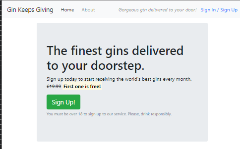
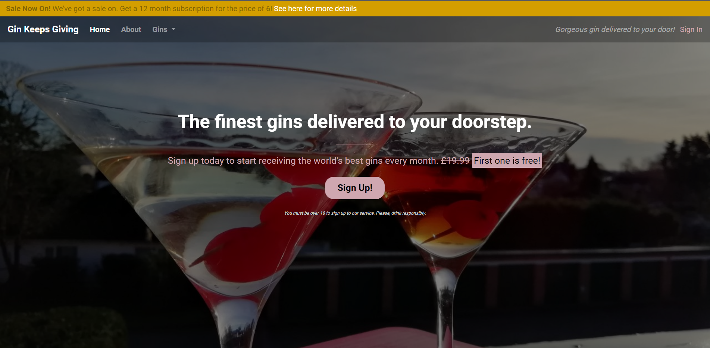
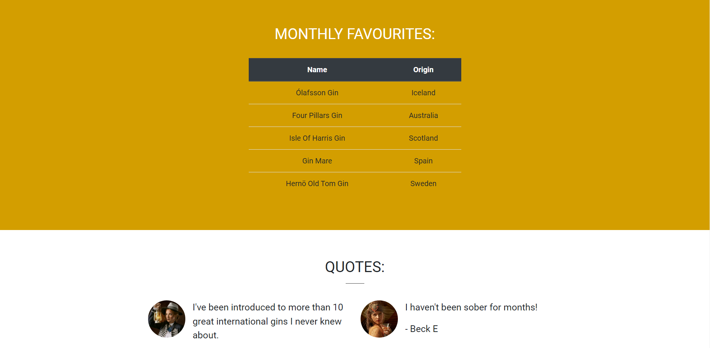
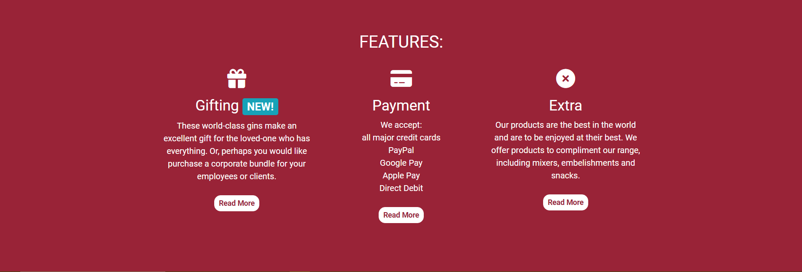

  
This is a fictional gin club website created using the features and components of Bootstrap 4.5
  
This site is based on the "Whiskey Drop" walk-through tutorial from Code Institute. 
Only HTML, custom CSS and Bootstrap were used.
  
Here are some screenshots of the "Gin Keeps Giving" site...
  
The site with only basic styling:
  

  
The finished site for the landing page (with dummy links):
  

 

 

  
**Photos:** 
Christmas gin martinis - J Dornan  
Woman holding a lantern and woman holding a glass - [JJ Jordan](https://external.ink?to=https://unsplash.com/@jjjordan)

  
Bootstrap 4.5 Documentation:
 
https://getbootstrap.com/docs/4.5/getting-started/introduction/
   
